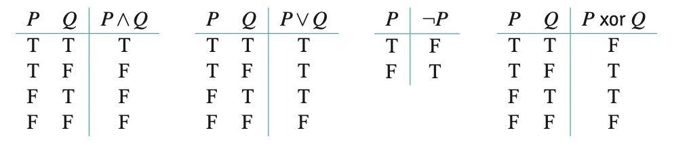

## Introduction and Summary
- Proof by contradiction - Hypothesizing that a theorem is false, and then obtaining a statement that is clearly false

## 2.2 Sets  
- When an element a is a member of a set A, we denote it by $a\subset A$
- |A| denotes the number of elements in a set, also called its size or its cardinality
  - Examples: |{1,2,3}| = 1, |{{1,2,3}}|=1
    
### 2.2.1 Making New Sets from Scratch 
- Write sets in the form {type of elements | condition(s)}

### 2.2.2 Finding Sets Inside Other Sets
- A is a subset of B if every element of A is also an element of B. Denoted as $A\subseteq B$
- A proper subset is one in which there is at least one element in B that is not in A. It utilizes the $\subset$ symbol
- $\emptyset\subset A$ for any set A because all zero of the elements in $\emptyset$ are also element of A
- Power set - Denoted by $\mathcal{P}{S}$, it is the set of all subsets of A. (If A is finite, then $|\mathcal{P}{A}| = 2^{|A|})$
- \ - means subtract between sets
- Complement - If $A \subset B$, then A' = B\A, all the elmeents of B that are not in A, is called the complement of A relative to B
- Universal set - Also sometimes referred to as the universe, is the particular set for all sets.

### 2.2.3 Proof Technique: Double-Inclusion
- Double inclusion - To show that two sets are equal, you can first show that $A\subset B$ and that $B\subset A$. 

Formal inclusion proof:
- Let a be any element of A.
- Reasoning, statements.
- Therefore, $a\in B,$ and so $A\subset B$

### 2.2.4 Making New Sets from Old  
- Union - Written as $A\cup B$, contains all element in A and element in B (excluding duplicates). 
- Intersection - Written as $A\cap B$, contains every element in both A and B.
- Disjoint - Two sets A and B are called disjointed if $A\cap B = \emptyset$. 

#### Theorem 2.2.14
If $A_1,...., A_n$ are disjoint finite sets, then $| A_1\cup...\cup A_n| = |A_1|+...+|A_n|$

- Cartesian product - Written $A x B$. Contains all possible ordered pairs where the first component is an element of A paired with an element of B
  - $A x B = \{(a,b) | a\in A$ and $b\in B\}$
    - These ordered pairs are also called tuples!

## 2.3 Logic    
- Statement - A sentence that is either true or false
- Connectives - Constructions used in logic to combine statements
  -  and - Verbal analogue to set intersection, so P-and-Q is only true if both P and Q are true
      -  Also written $\land$
  -  or - verbal analogue to set union, so P-or-Q is true whenever either P or Q is true
      -  Also written $\lor$
  -  not - makes a true statement false and makes a false statement true; it gives a statement its opposite meaning
      -  Also written $\neg$
  -  implies - means that one statement is a consequence of the other; it is also written as if-then and is called a conditional statement
     - Also written $\implies$
  - Truth table - A table that lists the truth values of a statement
  - Exclusive or - Abbreviated xor,  

There is a correspondence between set and logic notations:
  - $P\lor Q$ holds for those in the set $A=\{x|P \text{is true for x}\}$ and $ B = \{x| Q \text{is true for x}\}$, which form $A\cap B$
  - $P\land Q$ holds for those in the set $A =\{x|P \text{is true for x}\}$ or the set $B = \{x|Q \text{is true for x}\}$, which form $A\cup B$
  - In this sense, $\land$ statements corresponds to $\cap$ sets and $\lor$ statements corresponds to $\cup$ sets.
  - Elements in $\neg P$ are those not in the set $A=\{x|\text{P is true for x}\}$, or $\overline A$

- Biconditional - Also written $\iff$. Statement type to describe iff, or $(P\leftarrow Q) \land (P\rightarrow Q)$. 
  - To prove a biconditional statement you almost always have to split it into two implications and prove them separately
- Quantifiers - restrict the variables referred to in a statement.
  - $\exists$ means "there exists"
  - $\forall$ means "For all"

### Negation Interactions    
- To make it negation statements easier to understand, it can be useful to rewrite them as such:
  - $\neg(\forall \text{stuff}) \text{converts to} \exists \neg (\text{stuff})$
  - $\neg(\exists \text{stuff}) \text{converts to} \forall \neg (\text{stuff})$
- Additionally, it can be useful to negate each action in a statement one at a time.

>DeMorgan's laws (logic version):
> $(\neg P) \lor (\neg Q)$ is logically equivalent to $\neg (P \land Q)$, and $(\neg P) \land (\neg Q)$ is logically equivalent to $\neg(P \lor Q)$

>Negation and Implication: The statement $P \implies Q$ is logically equivalent to the statement $\neg Q \implies P$

Implications:
  - $P \implies Q$ - the original statement
  - $\neg Q \implies P$ - the contrapositive statement
  - $Q \implies P$ - the converse statement
  - $\neg P \implies \neg Q$ - the inverse statement, and contrapositive of the converse statement

## 2.5 Proof Techniques: Not!    
- Proof by contradiction - 

Template for a proof by contradiction:
  1. Restate the theorem in the form $\text{if (conditions) are true, then (conclusion) is true.}$
  2. On a scratch sheet, write $\text{suppose not.} Then write out (conditions) and the negation of (conclusion)
  3. Try to simplify the statement of $\neg (conclusion)$ and see what this might mean.
  4. Attempt to derive a contradiction of some kind--to one or more of(conditions) or to a commonly known mathematical truth.
  5. Repeat attempts until you are successful.
  6. Write up the results on a clean sheet, as follows.
      - Theorem: (State theorem here)
      - Proof: Suppose not. That is, suppose (conditions) are true but (conclusion) is false.
      - (Translate this to a simpler statement if applicable. Derive a contradiction.) 
      - Contradiction!
      - Therefore, (conclusion) is true. (Draw a box or checkmark or write Q.E.D. to indicate that you're done)
