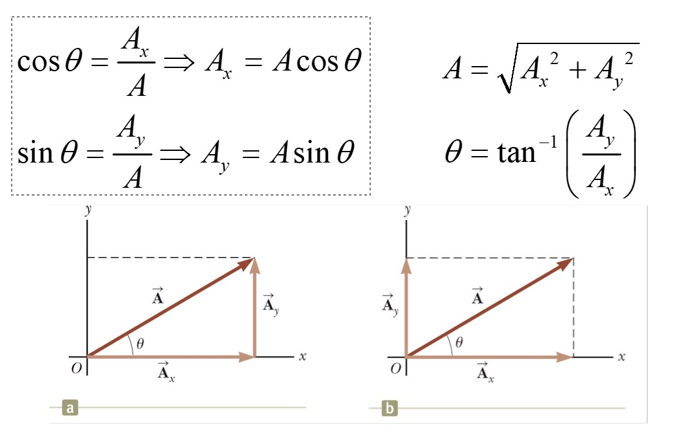
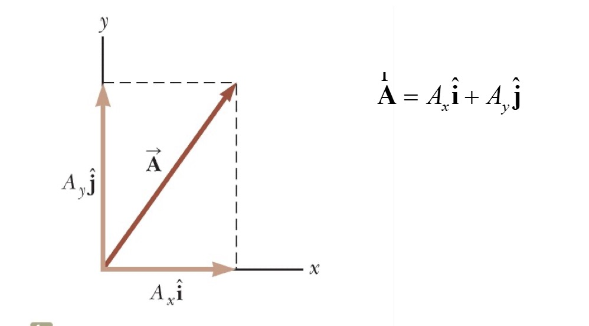
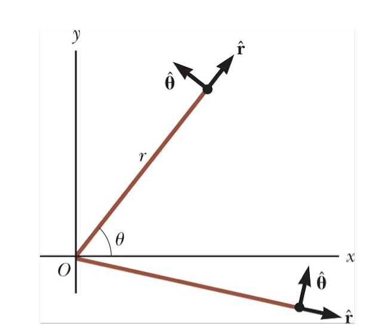
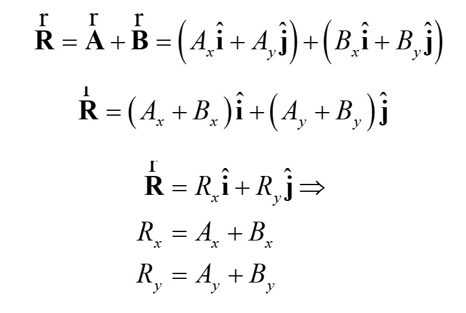
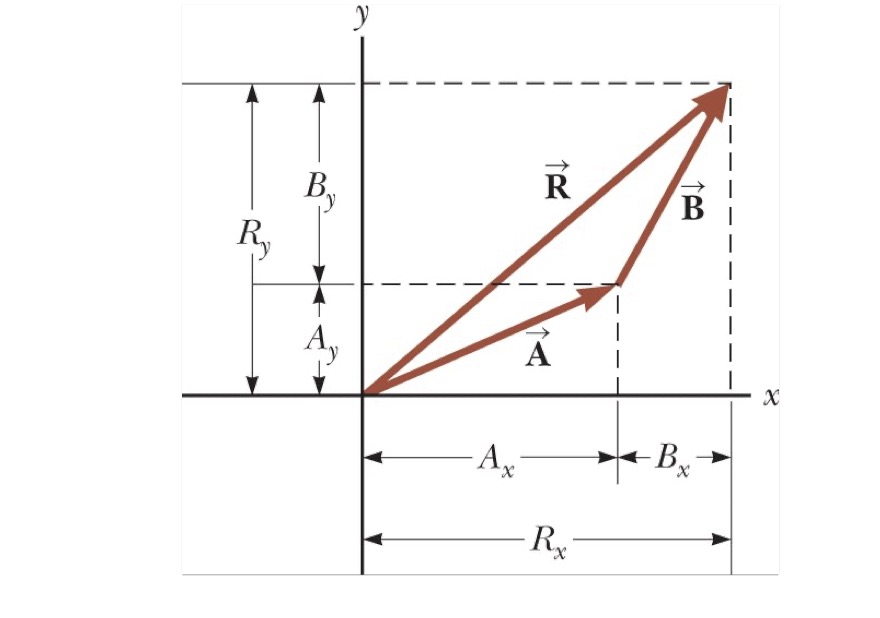
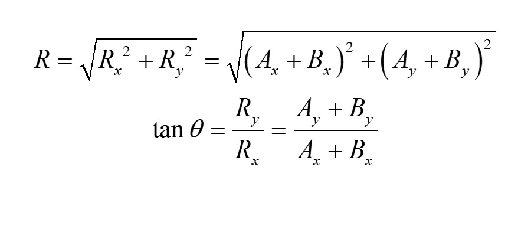

## Cartesian Coordinate System
- Two dimensions: can use Cartesian coordinate system:
  - Perpendicular axes intersect at points defined as origin O
- Cartesian coordinates of point in space: rectangular coordinates

## Polar Coordinate System  
- Also represent point in plane by its plane polar coordinates (r, $\theta$)
- In polar coordinate system:
  - r = distance from origin to point having Cartesian coordinates (x, y)
  - $\theta$ = angle between fixed axis (usually +x axis) and line drawn from origin to point
     - $\theta$ usually measured counterclockwise from +x axis

- $sin\theta$ = y/r
- $cos\theta$ = x/r
- $tan\theta$ = y/x
- $r=\sqrt{x^2+y^2}$

- Starting with plane polar coordinates of point
  - obtain Cartesian coordinates
    - $x=rcos\theta$
    - $x=rsin\theta$
- Starting with Cartesian coordinates
  - polar coordinates given by:
    - $tan\theta = \frac{y}{x}$
    - r equation: Pythagorean theorem

- Four equations relating (x,y) to (r, $\theta$) apply only when $\theta$ defined as shown

## Vector and Scalar Quantities  
- Scalar quantity: completely specified by a single value with an appropriate unit and has no direction
- Vector quantity: completely specified by a number with an appropriate unit (the magnitude of the vector) plus a direction.

## Displacement Vector  
- Direction of arrowhead = direction of displacement
- Length of arrow = magnitude of displacement
- Displacement arrow drawn from A to B regardless of particle travel path
- Only depends on initial and final position

## Basic Vector Arithmetic  
- Vectors A and B defined as equal if they have the same magnitude and point in the same direction
  - A = B only if *A=B* and if **A** and **B** point in the same direction along parallel lines

## Vector addition:   
A + B = B + A (commutative law of addition)     
A + (B + C) = (A + B) + C (associative law of addition)
-  Add vector B to vector A:
  - First Draw vector A on graph paper. Magnitude represented by convenient length scale.
  - Then draw vector B to same scale. Tail starting from tip of A
  -  Resultant vector R = vector draw from tail of A to tip of B
- R = vector draw from tail of the first vector to tip of last vector
- This technique often called "head to tail method"
- Vectors must have same units and be same type of quantity
- Same rule also applies to scalars

## Vector Subtraction and Scalar Multiplication
A + (-A) = 0
A - B = A + (-B)
scalar Multiplication: mA
- Vectors A and -A have same magnitude but point in opposite direction
- Scalar multiplication of vectors: If vector A multiplied by positive scalar quantity m: product mA = vector with same direction as A and magnitude mA
- If vector A multiplied by negative scalar quantity m: product mA directed opposite A

## Components of a Vector  
- Graphical method of adding vectors:
  - Not highly accurate
  - Not recommended for three dimensional problems
- New way of adding vectors uses projects of vectors along coordinate axes
  - These projections: components f the vector or rectangular components
  - Any vector can be completely described by components
- 
- $\Delta x$: parallel to x axis
- $\Delta y$: parallel to y axis

- Right figure:  
  - Three vectors form right triangle
  - $A=A_x + A_y$ 

- Components of vector A: $A_x and A_y$   
  - Note: figure(b) component vector $A_y$ moved to left so it lies along y axis
  - Component $A_x$ = projection of A along x axis
  - Component $A_y$ = projection of A along y axis

- Components positive or negative
  - $A_x$ positive if component vector $A_x$ points in positive x direction
  - $A_x$ negative of $A_x$ points in negative x direction
  - Similarly for $A_y$

- Magnitudes of components = lengths of two sides of right triangle with hypotenuse of length A    
- Magnitude and direction of A related to its components through

- Note: signs of components $A_x$ and $A_y$ depend on angle $\theta$  
  - If $\theta$ = 120 $A_x$ negative and $A_y$
  - If $\theta$ = 25 both $A_x$ and $A_y$ negative

## Unit Vectors    
- Vector quantities often expressed in terms of unit vectors
  - Unit vector: dimensionless vector having magnitude of exactly 1

- Unit vectors used to specify given direction and have no other physical significance    
  - Used as bookkeeping convenience in describing direction in space

- Symbols $\hat i, \hat j, \text{ and } \hat k$ represent unit vectors pointing in positive x, y, and z directions, respectively    
  - The "hats," or circumflexes, on symbols standard notation for unit vectors
- Unit vectors $\hat i, \hat j, \text{ and } \hat k$ form set of mutually perpendicular vectors in right-handed coordinate system

## Components of a Vector and Unit Vectors  
- 
- Product of component $A_x$ and unit vector $\hat i$ = component vector $A_x = A_x \hat i$
  - lies on x axis
  - Magnitude $|A_x|$
  - Likewise, $A_y = A_y \hat j$ = component vector of magnitude $|A_y|$ lying on y axis
- Unit vector notation for vector A above

  
- Consider polar coordinates
- Note: We can identify radial and angular unit vectors r and $\hat{\theta}$
  - Like rectangular coordinates: these vectors of unit length
  - Unlike rectangular coordinates: directions of radial and angular unit vectors depend on point

## Vector Addition using Components
 
- Adding vectors using components:
  - Add vector B to vector A
    - Add x and y components separately
- Rearrange terms
- Components of resultant vector
 
- Component method of adding vectors:
  - Add all x components together to find x component of resultant vector
  - Use same process for y components
  - Check addition by components with geometric construction

## Magnitude of a Vector    
   
- Magnitude of R and angle it makes with x axis obtained from components using these relationships

## Vectors in Three Dimensions  
 
- Extension to three-dimensional vectors:
- If A and B both have x, y, and z components _blank_ can be expressed in form shown
- Sum of A and B is:
- If vector R has x, y, and z components magnitude of vector is shown above
- Angle x that R makes with x axis found from equation shown above
  - Similar expressions for angles with respect to y and z axes shown in equation above.
